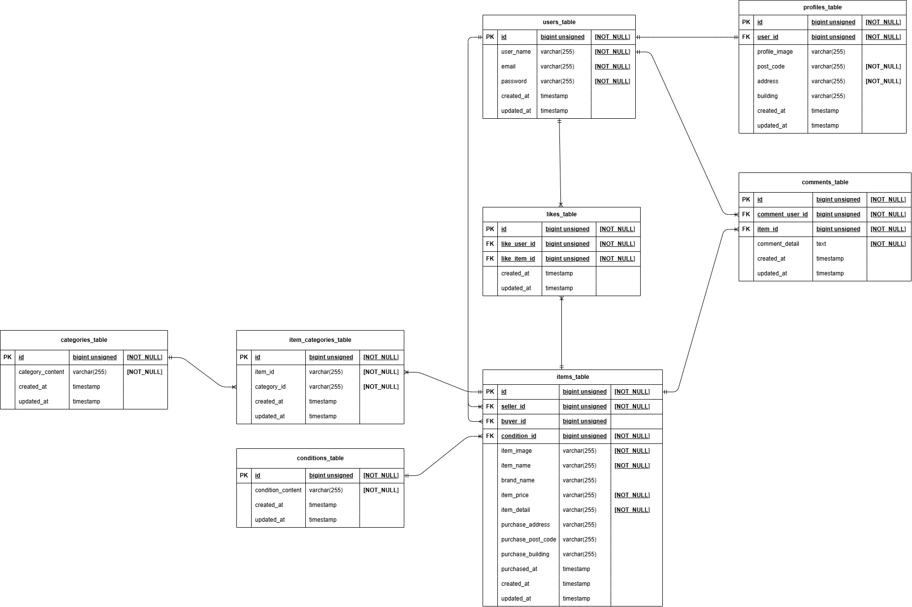

# test_contact-form

# COACHTECHフリマアプリ

## 1. 概要

Laravelを使用した、個人同士での商品の売り買いが可能なフリマアプリです。

## 2. 環境構築の手順

このプログラムを動かすには　Docker Desktop (Windows/Mac)　が必要ですので、インストールしてください。

1. リポジトリのクローン
`git clone git@github.com:chisa-para/furima-app.git`
`cd furima-app`

2. パッケージのインストール
```
docker run --rm \
-u "$(id -u):$(id -g)" \
-v "$(pwd):/var/www/html" \
-w /var/www/html \
laravelsail/php83-composer:latest \
composer install --ignore-platform-reqs
```

3. 環境設定ファイルの作成
`cp .env.example .env`

4. コンテナの起動
`./vendor/bin/sail up -d --build`

5. アプリケーションキーの生成
`./vendor/bin/sail artisan key:generate`

6. マイグレーションとシーディング
`./vendor/bin/sail artisan migrate --seed`

7. シンボリックリンクの設定
`./vendor/bin/sail artisan storage:link`

## 3. 開発環境

- 商品一覧画面:http://localhost/
- ユーザー登録:http://localhost/register
- ログイン登録:http://localhost/login

下記ユーザーのアカウントと出品商品が登録されています。
　- 山田一郎
　　（メールアドレス＝Yamada@example.com、パスワード＝321DoubleB、出品商品＝腕時計・マイク）
　- 鈴木花子
　　（メールアドレス＝hanako@example.com、パスワード＝furima875、出品商品＝玉ねぎ・ショルダーバッグ・メイクセット）
　- 瓜田杉郎
　　（メールアドレス＝uritai@example.com、パスワード＝100items、出品商品＝HDD・革靴・PC・タンブラー・コーヒーミル）

- phpMyAdmin:http://localhost:8080/


## 4. メール認証について
本プロジェクトは新規ユーザー登録の際メール認証システムを使用します。
- MailHog:http://localhost:8025/

## 5. 決済機能について
本プロジェクトの決済機能を動かすには、Stripeのアカウントが必要です。
- Stripe公式サイト(新規登録)：https://dashboard.stripe.com/register
- Stripe公式サイト(ログイン)：https://dashboard.stripe.com/login

1. Stripe公式サイトにてアカウントを作成
2. ダッシュボード開き、「APIキー」から以下の２つを取得
　- 公開可能キー (pk_test_...)
　- シークレットキー (sk_test_...)
3. .env内に各キーを張り付ける
　STRIPE_KEY=取得した公開可能キー
　STRIPE_SECRET=取得したシークレットキー
　　
テスト用カード情報
　カード番号：4242 4242 4242 4242
　有効期限：有効な将来の日付（12/34など）
　セキュリティコード：任意の3桁 (American Express カードの場合は4桁)
　名前：任意の名前（ローマ字）

## 6.テストの実行について
1. テスト用環境ファイルの作成
`cp .env.testing.example .env.testing`
`./vendor/bin/sail artisan key:generate --env=testing`

2. テスト用データのマイグレーション
`./vendor/bin/sail artisan migrate --env=testing`

3. テストの実行
`./vendor/bin/sail phpunit`

※もし .env の変更が反映されない場合や、挙動がおかしい場合は、一度以下のコマンドで設定キャッシュをクリアしてください。
`./vendor/bin/sail artisan config:clear`

## 7. 使用技術（実行環境）

- PHP 8.3
- Laravel 13.0
- MySQL 8.4
- nginx / Laravel Sail
- Docker / Docker Desktop
- Composer, npm, Stripe API

## 8.ER図
